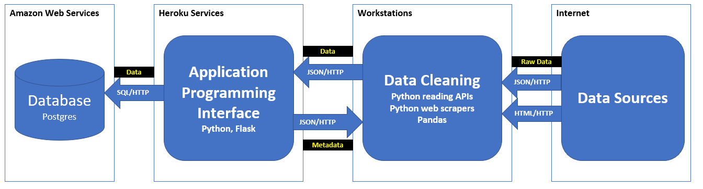

# It's a Gas!

## Proposal

There is an article in *Autoweek* announcing  that Ford will stop selling sedans (http://autoweek.com/article/car-news/ford-will-stop-selling-sedans-north-america-entirely-face-unstoppable-crossover. )This seemed strange, since sedans would seem to be the most popular car.  While preparing for this project, there was a discussion about the vehicles we drove.  The Ford Mustang, a coupe was one and another was a Ram Pickup Truck.  This prompted the question:  <b>What drives the automobile market?</b>  

This project is an attempt to answer this question by analyzing multiple data sources.  It is unknown where the data will reveal.  The approach will have an obvious numerical aspect to it.  However, judging by  the discussion of our own vehicles, there must be a visceral, emotional aspect to purchasing habits.  Hence, the name of this project:  <b>It’s a Gas</b>  This term does not mean only gas power vehicle are considered.  It is the term associated with the fun aspect of driving vehicles of our choosing.

## Data Sources
At the time of this proposal, team members are selecting and suggesting data sources that would contibute to this story.

Where the data leads is uncertain.

## Data Architecture

  

__Data Architecture__ consists of three major components.
1. __Data Acquisition__ Data is acquired from the Internet, cleaned, and loaded into a database.
2. __Data Modeling__ Relatively static operations are done with the data.
    * __Aggregation__ Data is aggregated over hierarchies to pre-calculate summary levels.
    * __Calculation__ Ratios, ordinal factors, and accumulations are calculated.
    * __Integration Views__ are created to integrate data from disparate sources.
    * __Performance__ Materialized views are created for integrating relative static data.
3. __Data Access__ Presenting data for analysis.
    * __Data Visualization__  Web pages utilizing plotting and RESTful calls present the data in visually meaningful way.
    * __Data Exploration__ The same data is acquired by Python modules using Pandas and RESTful calls.

## Web Front-End template

Front end functionality and design is still tentative, this is just a rough draft.

## Data Acquisition

Multiple datasources were selected.  This is done by API access, web scraping, or "cut and paste".

Once the data has been acquired, it must be cleansed, removing erroneous values and assessing null values.

The prepared data is loaded into the database using an API.

## Data Modeling

Performance can be improved and visualization simplified by doing aggregate functions in advance.

If the data is hierarchicaly, then aggregation over the hierarchy could be done in advance.

Views are used for integration by joining tables that are sourced from different data sources.

## Data Access

For Data Visualization, Javascript running in Chrome will use RESTful calls to get data from the database.  Javascript will use various libraries to plot the data.

Data Exploration will be ad hoc in nature.  Python programs using Pandas and Matplotlib libraries will analyze and plot data.  Again, API calls will be used to acquire data from the database.
