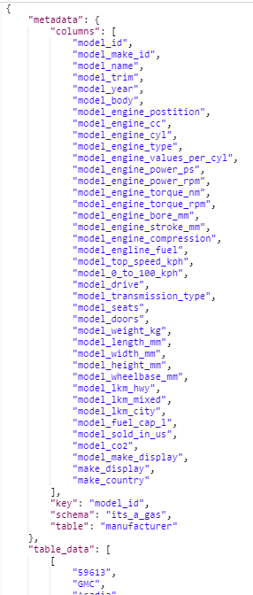
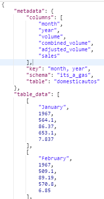
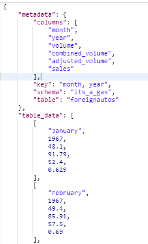
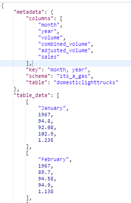
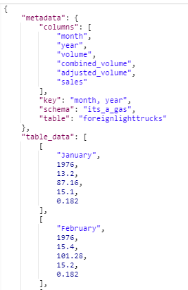
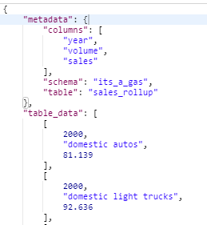
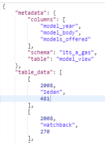
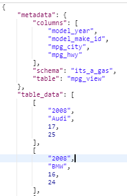
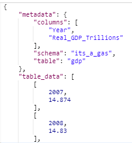
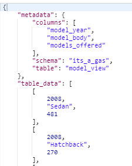

# Application Programming Interface User Guide
## It's A Gas:  What Drives the Automotive Market?
## Summary
Data for the online analysis and visualizations is provided by a thick-server architecture. 
An online program provides the following functions:
* Provide raw data.
* Provide aggregated data.
* Load raw data.
* Aggregate data.

Descriptions of Universal Resource Locators (URL) are listed below.

## Home Page
<pre>https://its-a-gas.herokuapp.com</pre>

The index.html page is returned.  It is the dashboard for accessing visualizations and other API functions.

## Manufacturer (POST, GET, DELETE)
<pre>https://its-a-gas.herokuapp.com/manufacturer</pre>

This raw URL provisions the entire Manufacturer dataset.  This URL is used in cases where the other aggregated URLs are deficient.

## Domestic Automobiles (POST, GET)
<pre>https://its-a-gas.herokuapp.com/domesticautos</pre>

This raw URL provisions the entire domestic automobile sales dataset.  This URL is used in cases where other aggregated URLs are deficient.

## Foreign Automobiles (POST, GET)
<pre>https://its-a-gas.herokuapp.com/foreignautos</pre>

This raw URL provisions the entire foreignautos sales dataset.  This URL is used in cases where other aggregated URLs are deficient.

## Domestic Light Trucks (POST, GET)
<pre>https://its-a-gas.herokuapp.com/domesticlighttrucks</pre>

This raw URL provisions the entire domesticlighttrucks sales dataset.  This URL is used in cases where other aggregated URLs are deficient.

## Foreign Light Trucks (POST, GET)
<pre>https://its-a-gas.herokuapp.com/foreignlighttrucks</pre>

This raw URL provisions the entire foreignlighttrucks sales dataset.  This URL is used in cases where other aggregated URLs are deficient.

## Sales Rollup (GET)
<pre>https://its-a-gas.herokuapp.com/sales_rollup</pre>

This aggregated data show sales by year and automotive dataset.   It is also a rollup structure, so sales for a automotive datasets for a year is also included.

## Models Offered by Year (GET)
<pre>https://its-a-gas.herokuapp.com/models_offered_by_year</pre>

This aggregated data show the number of models offered by year and body style.   It is also a cube structure, so all possible versions of totals is included.

## Miles Per Gallon (GET)
<pre>https://its-a-gas.herokuapp.com/mpg</pre>

This aggregated data is the city and highway miles per gallon (mpg) by year and make.  This is derived from the manufacturer data.  This required a conversion from liters per 100 kilometers (lkm).

## Gross Domestic Product (GET)
<pre>https://its-a-gas.herokuapp.com/gdp</pre>

This is the GDP used as a possible factor in analysis and visualizations.

## Data Loader (GET)
<pre>https://its-a-gas.herokuapp.com/(dataset)</pre>
This executes the stored procedure that loads a comma separated value (CSV) file for a table.  Valid parameters are "domesticautos", "foreignautos", "domesticlighttrucks", and "foreignlightrucks".  The
CSV files are stored on Simple Storage Service (S3) hosted by Amazon Web Services (AWS).

## Manufacturer Loader (GET)
<pre>https://its-a-gas.herokuapp.com/manufacturer_loader</pre>
This executes the stored procedure that loads a comma separated value (CSV) files into the manufacturer table.  The files loaded are:
* Audi.csv
* BMW.csv
* Ferrari.csv
* Ford.csv
* GMC.csv
* Honda.csv
* Kia.csv
* Lamborghini.csv
* Maserati.csv
* Mazda.csv
* Nissan.csv
* Subaru.csv
* Tesla.csv
* Toyota.csv
* Volkswagen.csv
* Volvo.csv

These files are stored in S3 on AWS.

## Build Model Table (GET)
<pre>https://its-a-gas.herokuapp.com/build_model_table</pre>

This stored procedure builds the "Models Offered by Year" API from the Manufacturer table.  The resulting data is returned for confirmation.  This should be run after any "Manufacturer Loader" execution.

